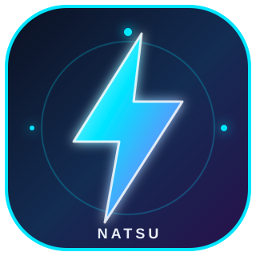

  

  <h1>⚡ NatsuTech's 🇨🇬 (Alva Dev)</h1>
  
<strong>Software Developer · JavaScript · Automation · Open Source</strong>

  

   

  
  

 

## 👋 About me

I’m **NatsuTech's 🇨🇬 (Alva Dev)**, a public developer building practical software across the web, automation, developer tools and open source.

- 💻 Building web apps, APIs and developer tools with JavaScript
- 🤖 Creating automation systems, integrations and WhatsApp projects
- 🧩 Exploring product ideas from prototype to deployable software
- 📱 Comfortable with terminal and mobile-first workflows
- 🌍 Based in the Republic of Congo 🇨🇬
- 🛠️ Turning useful ideas into tools people can actually use

## 🧰 What I build

<table>
  <tr>
    <td width="25%" align="center"><strong>🌐 Web</strong> Interfaces, dashboards and full-stack apps</td>
    <td width="25%" align="center"><strong>⚙️ APIs</strong> Services, integrations and backends</td>
    <td width="25%" align="center"><strong>🤖 Automation</strong> Bots, workflows and useful scripts</td>
    <td width="25%" align="center"><strong>🛠️ Dev tools</strong> CLI, Termux and open-source utilities</td>
  </tr>
</table>

## 🚀 Featured projects

<table>
  <tr>
    <td width="50%">
      <h3>🤖 Natsu Baileys V10</h3>
      
Custom WhatsApp bot foundation with pairing code, multi-session support and a broad command system.

      <a href="https://github.com/kinggggg444/natsu-baileys-v10">View repository →</a>
    </td>
    <td width="50%">
      <h3>⚡ DENTSU MD V10</h3>
      
WhatsApp multi-device project made for fast setup, experimentation and community use.

      <a href="">View repository →</a>
    </td>
  </tr>
  <tr>
    <td width="50%">
      <h3>🧪 MINI-NATSU-MD</h3>
      
A smaller bot project for testing ideas and shipping quickly from a mobile workflow.

      <a href="">View repository →</a>
    </td>
    <td width="50%">
      <h3>🧰 NatsuTech Project</h3>
      
A multi-session WhatsApp project with pairing code and a growing command ecosystem.

      <a href="">View repository →</a>
    </td>
  </tr>
</table>

## 🧠 Tech stack

  
  
  
  
  

## 📊 GitHub activity

  
  

  

## 🤝 Connect

If you’re building a bot, experimenting with automation or want to collaborate on an open-source project, open an issue or start a discussion in one of my repositories.

## 🌐 Find me online

  
  
  
  
  
  

  <strong>💼 Contact professionnel :</strong>
  <a href="https://wa.me/242053323191">+242 05 33 23 19 1</a>

  
  

 

  

